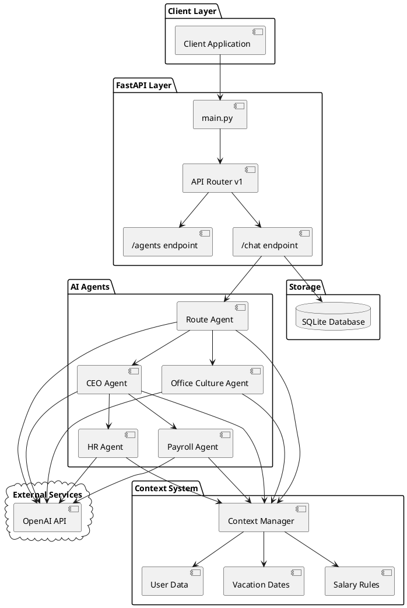
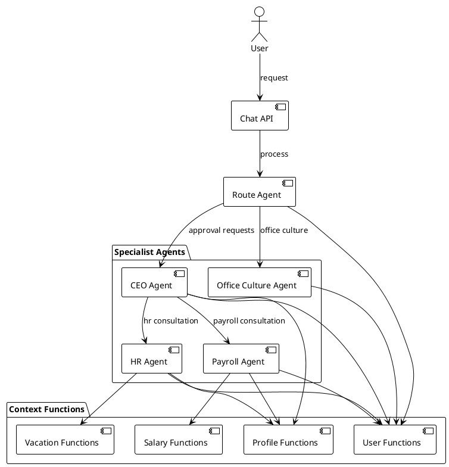
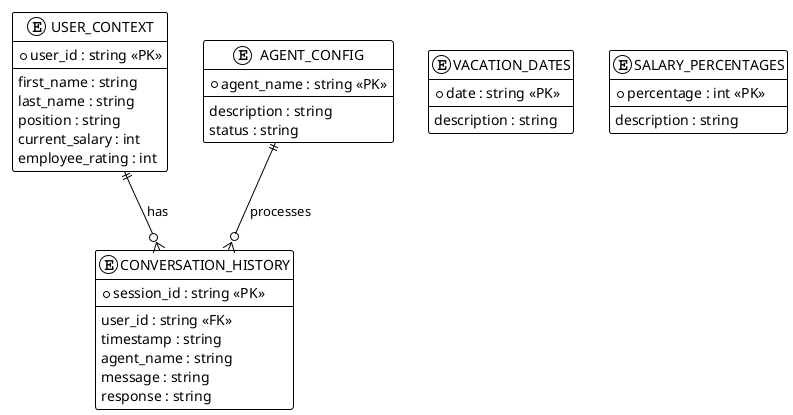
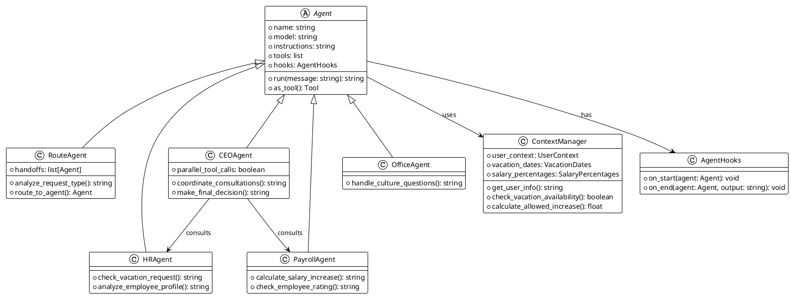

# AI Agents FastAPI Application

Полнофункциональное FastAPI приложение для работы с AI агентами для управления корпоративными процессами.

## Архитектура системы

### Общая архитектура

> **Как просмотреть PlantUML диаграммы:**
> 1. **VS Code**: установите расширение PlantUML и откройте Preview
> 2. **Онлайн**: скопируйте код диаграммы и вставьте на [plantuml.com](http://www.plantuml.com/plantuml/uml/)
> 3. **GitHub**: диаграммы отображаются как блоки кода (рендеринг не поддерживается)
> 4. **Альтернатива**: см. текстовую схему ниже



### Взаимодействие агентов

> 💡 **Совет**: скопируйте код диаграммы и вставьте на [plantuml.com](http://www.plantuml.com/plantuml/uml/) для онлайн просмотра



### Поток обработки запросов

> 💡 **Sequence диаграмма**: показывает полный жизненный цикл запроса с параллельными консультациями

```plantuml
@startuml
!theme plain
skinparam backgroundColor white

actor User
participant "Chat API" as API
participant "Route Agent" as Route
participant "Context Manager" as Context
participant "CEO Agent" as CEO
participant "HR Agent" as HR
participant "Payroll Agent" as Payroll
database "SQLite DB" as DB
cloud "OpenAI" as OpenAI

User -> API : POST /chat/
API -> Context : Initialize Context
Context --> API : User data

API -> Route : Process message
Route -> Context : get_user_basic_info()
Context --> Route : User info

Route -> OpenAI : Analyze request
OpenAI --> Route : approval_request

Route -> CEO : Handoff to CEO

note over CEO : CEO coordinates consultations

par CEO consultations
    CEO -> HR : hr_consultation
    HR -> Context : check_vacation_request
    Context --> HR : Vacation analysis
    HR -> OpenAI : Generate response
    OpenAI --> HR : Decision
    HR --> CEO : Result
else
    CEO -> Payroll : payroll_consultation
    Payroll -> Context : calculate_salary_increase
    Context --> Payroll : Salary analysis
    Payroll -> OpenAI : Generate response
    OpenAI --> Payroll : Decision
    Payroll --> CEO : Result
end

CEO -> OpenAI : Generate final decision
OpenAI --> CEO : Combined response
CEO --> Route : Final decision

Route -> DB : Save conversation
DB --> Route : Saved

Route --> API : Final response
API --> User : Combined decision

@enduml
```

### Модель данных

> 💡 **ER диаграмма**: структура данных с полями, ключами и связями между таблицами



### Архитектура классов агентов

> 💡 **Class диаграмма**: иерархия наследования агентов с методами и связями



## Структура проекта

```
open_ai_full_app/
├── src/
│   ├── main.py                          # Основной файл FastAPI приложения
│   ├── api/                             # API маршруты
│   │   └── v1/
│   │       ├── routes.py                # Основной роутер v1
│   │       └── endpoints/               # API эндпоинты
│   │           ├── agents.py            # Информация об агентах
│   │           └── chat.py              # Обработка сообщений
│   ├── agents_core/                     # Система AI агентов
│   │   └── agents/
│   │       ├── route_agent.py           # Маршрутизатор запросов
│   │       ├── ceo_agent.py             # Исполнительный директор
│   │       ├── hr_agent.py              # HR менеджер
│   │       ├── payroll_agent.py         # Менеджер по зарплате
│   │       ├── office_culture.py        # Офисная культура
│   │       ├── hooks.py                 # Хуки для мониторинга
│   │       └── context/                 # Система контекста
│   │           ├── context_manager.py   # Менеджер контекста
│   │           ├── context_config.py    # Конфигурация данных
│   │           └── functions.py         # Контекстные функции
│   └── database/                        # База данных
│       └── conversation_history.db      # SQLite БД для истории
├── tests/                               # Тесты
├── requirements.txt                     # Зависимости Python
└── .env.example                         # Пример переменных окружения
```

## Установка

1. Клонируйте репозиторий и перейдите в директорию:
```bash
cd open_ai_full_app
```

2. Создайте виртуальное окружение:
```bash
python3 -m venv venv
source venv/bin/activate  # Linux/Mac
# или
venv\\Scripts\\activate  # Windows
```

3. Установите зависимости:
```bash
pip install -r requirements.txt
```

4. Создайте файл `.env` на основе `.env.example`:
```bash
cp .env.example .env
```

5. Отредактируйте `.env` файл, добавив ваш OpenAI API ключ:
```
OPENAI_API_KEY=your_actual_api_key_here
MODEL_NAME=gpt-4
SECRET_KEY=your-secret-key-here
```

## Запуск приложения

### Режим разработки
```bash
cd src
python3 main.py
```

### С помощью uvicorn
```bash
cd src
uvicorn main:app --reload --host 0.0.0.0 --port 8000
```

Приложение будет доступно по адресу: http://localhost:8000

## API Документация

После запуска приложения документация API доступна по адресам:
- Swagger UI: http://localhost:8000/docs
- ReDoc: http://localhost:8000/redoc

## Описание компонентов

### AI Агенты

#### 🚦 Route Agent - Маршрутизатор запросов
**Функции:**
- Анализ входящих запросов пользователей
- Определение типа запроса (офисная культура vs. запросы на утверждение)
- Маршрутизация к соответствующему агенту
- Персонализация ответов через контекстные функции

**Маршрутизация:**
- **Office Culture** → Office Culture Agent (вопросы о культуре, общие вопросы)
- **Approval Requests** → CEO Agent (отпуска, повышения, командировки)

#### 👔 CEO Agent - Исполнительный директор
**Функции:**
- Утверждение запросов на отпуска
- Решения о повышении зарплаты
- Одобрение командировок
- Координация между HR и Payroll департаментами

**Возможности:**
- Параллельные консультации с HR и Payroll агентами
- Комплексный анализ заявок сотрудников
- Принятие окончательных решений на основе данных

**Инструменты:**
- Контекстные функции пользователя
- Консультации с HR департаментом
- Консультации с Payroll департаментом
- Анализ профиля и правомочности сотрудника

#### 👤 HR Agent - Менеджер по кадрам
**Функции:**
- Обработка запросов на отпуска
- Проверка доступности дат отпусков
- Информация о сотрудниках
- Управление кадровыми политиками

**Возможности:**
- Анализ запросов на отпуска с проверкой доступности дат
- Предложение альтернативных дат при конфликтах
- Оценка правомочности сотрудников на льготы
- Персонализированные ответы

**Инструменты:**
- `get_available_vacation_dates()` - доступные даты отпусков
- `check_vacation_request(dates)` - проверка запроса на отпуск
- `get_employee_profile()` - профиль сотрудника
- `analyze_employee_eligibility()` - анализ правомочности

#### 💰 Payroll Agent - Менеджер по зарплате
**Функции:**
- Расчеты повышения зарплаты
- Анализ финансовых запросов
- Проверка соответствия рейтинга сотрудника
- Генерация отчетов по компенсациям

**Возможности:**
- Расчет повышения зарплаты с учетом рейтинга сотрудника
- Проверка доступных процентов повышения
- Определение максимально допустимого повышения
- Детальный анализ финансовых изменений

**Инструменты:**
- `get_employee_salary_info()` - информация о зарплате
- `calculate_salary_increase(percentage)` - расчет повышения
- `get_max_allowed_salary_increase()` - максимальное повышение
- `get_available_salary_increases()` - доступные проценты

#### 🏢 Office Culture Agent - Агент офисной культуры
**Функции:**
- Ответы на вопросы о корпоративной культуре
- Информация об офисной атмосфере
- Общие вопросы о компании
- Представление компании

**Возможности:**
- Персонализированные ответы о корпоративной культуре
- Информация о рабочей атмосфере
- Ответы на общие вопросы сотрудников

### Система контекста

#### 🗂️ Context Manager
Центральный менеджер для управления контекстом пользователя и данными:

**Компоненты:**
- **User Context** - информация о пользователе (имя, должность, зарплата, рейтинг)
- **Vacation Context** - доступные даты отпусков
- **Salary Context** - доступные проценты повышения зарплаты

#### 🔧 Context Functions
Набор функций для работы с контекстными данными:

**Функции пользователя:**
- `get_user_info()` - полная информация о пользователе
- `get_user_basic_info()` - базовая информация (имя, должность)
- `get_user_rating()` - рейтинг сотрудника

**Функции отпусков:**
- `get_available_vacation_dates()` - доступные даты
- `check_vacation_request(dates)` - проверка запроса
- `check_single_vacation_date(date)` - проверка одной даты

**Функции зарплаты:**
- `get_employee_salary_info()` - информация о зарплате
- `calculate_salary_increase(percentage)` - расчет повышения
- `get_max_allowed_salary_increase()` - максимальное повышение

**Аналитические функции:**
- `get_employee_profile()` - полный профиль сотрудника
- `analyze_employee_eligibility()` - анализ правомочности

### Система мониторинга

#### 📊 Agent Hooks
Унифицированная система для отслеживания жизненного цикла агентов:

**События:**
- `on_start()` - начало выполнения агента
- `on_end()` - завершение работы агента с результатом

**Функции:**
- Логирование с временными метками
- Отслеживание производительности агентов
- Мониторинг результатов выполнения

## Основные эндпоинты

- `GET /` - Корневой эндпоинт
- `GET /health` - Проверка здоровья
- `GET /api/v1/agents/` - Список агентов
- `GET /api/v1/agents/{agent_name}` - Информация об агенте
- `POST /api/v1/chat/` - Отправить сообщение агенту
- `GET /api/v1/chat/history/{agent_name}` - История чата

## Примеры использования

### Получить список агентов
```bash
curl http://localhost:8000/api/v1/agents/
```

### Отправить сообщение HR агенту
```bash
curl -X POST http://localhost:8000/api/v1/chat/ \
  -H "Content-Type: application/json" \
  -d '{
    "agent_name": "hr",
    "message": "I want to take vacation from August 15 to 30"
  }'
```

## Разработка

### Запуск тестов
```bash
pytest tests/
```

### Форматирование кода
```bash
black src/
```

### Проверка типов
```bash
mypy src/
```

## Особенности архитектуры

### 🎯 Интеллектуальная маршрутизация
- **Автоматическое определение намерений** - Route Agent анализирует запросы и направляет к подходящему специалисту
- **Контекстная персонализация** - все агенты получают доступ к информации о пользователе для персонализированных ответов

### 🤝 Межагентная координация
- **Параллельные консультации** - CEO Agent может одновременно консультироваться с HR и Payroll агентами
- **Handoff механизм** - плавная передача управления между агентами
- **Централизованные решения** - CEO Agent принимает окончательные решения на основе консультаций

### 📊 Контекстно-зависимые решения
- **Рейтинг-ориентированные расчеты** - размер повышения зарплаты зависит от рейтинга сотрудника
- **Проверка правомочности** - система автоматически проверяет право сотрудника на льготы
- **Интеллектуальные альтернативы** - предложение альтернативных дат при конфликтах в расписании

### 🔍 Мониторинг и отслеживание
- **Lifecycle hooks** - отслеживание выполнения каждого агента
- **Сохранение истории** - все диалоги сохраняются в SQLite для анализа
- **Временные метки** - детальное логирование времени выполнения

### ⚡ Производительность
- **Параллельное выполнение** - CEO Agent поддерживает параллельные вызовы инструментов
- **Кэширование контекста** - Context Manager предоставляет быстрый доступ к данным пользователя
- **Асинхронная обработка** - все агенты работают асинхронно

## Технологии

- **FastAPI** - Современный веб-фреймворк для API
- **OpenAI Agents 0.2.6** - Фреймворк для создания AI агентов
- **Pydantic** - Валидация и сериализация данных
- **SQLite** - Легковесная база данных для хранения истории
- **OpenAI API** - Модели GPT для обработки естественного языка
- **Uvicorn** - Высокопроизводительный ASGI сервер
- **Python 3.8+** - Современная версия Python с поддержкой async/await

## Лицензия

MIT License
