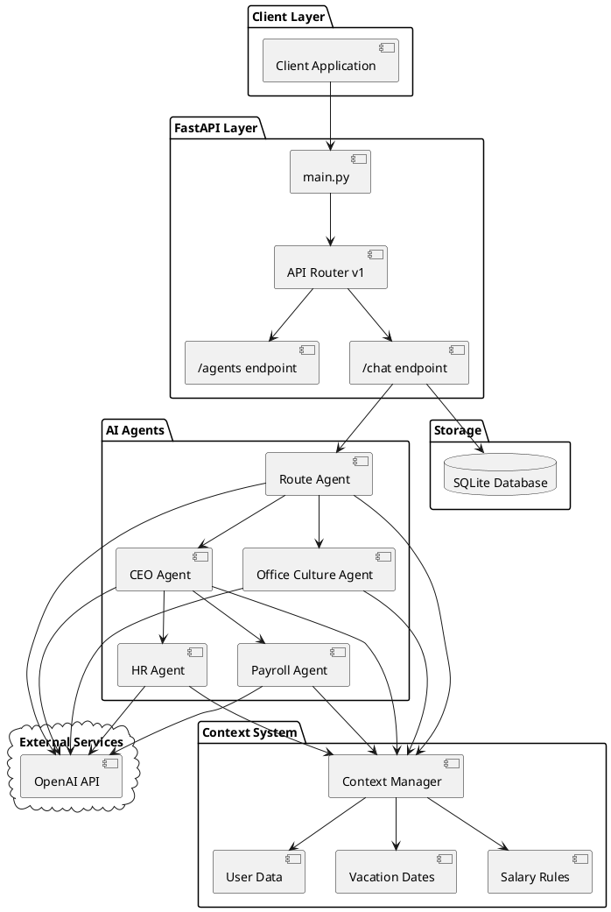
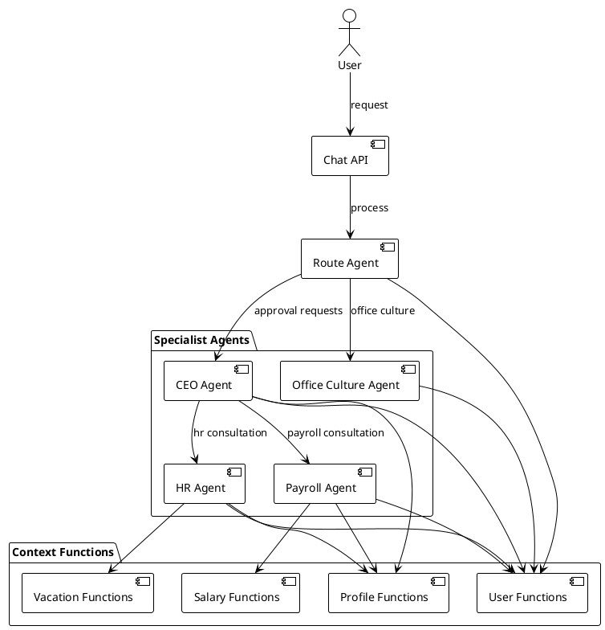
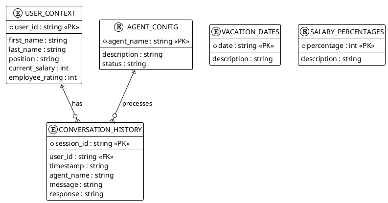
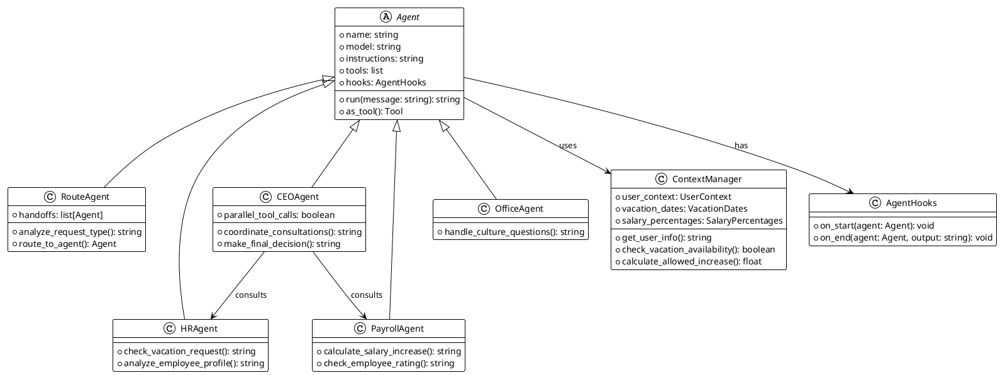

# AI Agents FastAPI Application

A full-featured FastAPI application for working with AI agents to manage corporate processes.

## System Architecture

### Overall Architecture




### Agent Interaction

> 💡 **Tip**: copy the diagram code and paste it on [plantuml.com](http://www.plantuml.com/plantuml/uml/) for online viewing



### Request Processing Flow

> 💡 **Sequence diagram**: shows the complete request lifecycle with parallel consultations

```plantuml
@startuml
!theme plain
skinparam backgroundColor white

actor User
participant "Chat API" as API
participant "Route Agent" as Route
participant "Context Manager" as Context
participant "CEO Agent" as CEO
participant "HR Agent" as HR
participant "Payroll Agent" as Payroll
database "SQLite DB" as DB
cloud "OpenAI" as OpenAI

User -> API : POST /chat/
API -> Context : Initialize Context
Context --> API : User data

API -> Route : Process message
Route -> Context : get_user_basic_info()
Context --> Route : User info

Route -> OpenAI : Analyze request
OpenAI --> Route : approval_request

Route -> CEO : Handoff to CEO

note over CEO : CEO coordinates consultations

par CEO consultations
    CEO -> HR : hr_consultation
    HR -> Context : check_vacation_request
    Context --> HR : Vacation analysis
    HR -> OpenAI : Generate response
    OpenAI --> HR : Decision
    HR --> CEO : Result
else
    CEO -> Payroll : payroll_consultation
    Payroll -> Context : calculate_salary_increase
    Context --> Payroll : Salary analysis
    Payroll -> OpenAI : Generate response
    OpenAI --> Payroll : Decision
    Payroll --> CEO : Result
end

CEO -> OpenAI : Generate final decision
OpenAI --> CEO : Combined response
CEO --> Route : Final decision

Route -> DB : Save conversation
DB --> Route : Saved

Route --> API : Final response
API --> User : Combined decision

@enduml
```

### Data Model

> 💡 **ER diagram**: data structure with fields, keys and relationships between tables



### Agent Class Architecture

> 💡 **Class diagram**: agent inheritance hierarchy with methods and relationships



## Project Structure

```
open_ai_full_app/
├── src/
│   ├── main.py                          # Main FastAPI application file
│   ├── api/                             # API routes
│   │   └── v1/
│   │       ├── routes.py                # Main v1 router
│   │       └── endpoints/               # API endpoints
│   │           ├── agents.py            # Agent information
│   │           └── chat.py              # Message processing
│   ├── agents_core/                     # AI agents system
│   │   └── agents/
│   │       ├── route_agent.py           # Request router
│   │       ├── ceo_agent.py             # Executive director
│   │       ├── hr_agent.py              # HR manager
│   │       ├── payroll_agent.py         # Payroll manager
│   │       ├── office_culture.py        # Office culture
│   │       ├── hooks.py                 # Monitoring hooks
│   │       └── context/                 # Context system
│   │           ├── context_manager.py   # Context manager
│   │           ├── context_config.py    # Data configuration
│   │           └── functions.py         # Context functions
│   └── database/                        # Database
│       └── conversation_history.db      # SQLite DB for history
├── tests/                               # Tests
├── requirements.txt                     # Python dependencies
└── .env.example                         # Environment variables example
```

## Installation

1. Clone the repository and navigate to the directory:
```bash
cd open_ai_full_app
```

2. Create a virtual environment:
```bash
python3 -m venv venv
source venv/bin/activate  # Linux/Mac
# or
venv\\Scripts\\activate  # Windows
```

3. Install dependencies:
```bash
pip install -r requirements.txt
```

4. Create a `.env` file based on `.env.example`:
```bash
cp .env.example .env
```

5. Edit the `.env` file, adding your OpenAI API key and PubSub configuration:
```
OPENAI_API_KEY=your_actual_api_key_here
MODEL_NAME=gpt-4
SECRET_KEY=your-secret-key-here

# Google Cloud PubSub Configuration
PUBSUB_PROJECT_ID=your-gcp-project-id
PUBSUB_TOPIC_ID=agents-topic

# Google Cloud Authentication (optional if using service account key)
GOOGLE_APPLICATION_CREDENTIALS=path/to/your/service-account-key.json
```

**Note**: For PubSub integration, you need to:
- Create a Google Cloud Project
- Enable the Pub/Sub API
- Create a topic in your GCP console
- Set up authentication (service account key or Application Default Credentials)

## Running the Application

### Development Mode
```bash
cd src
python3 main.py
```

### Using uvicorn
```bash
cd src
uvicorn main:app --reload --host 0.0.0.0 --port 8000
```

The application will be available at: http://localhost:8000

## API Documentation

After starting the application, API documentation is available at:
- Swagger UI: http://localhost:8000/docs
- ReDoc: http://localhost:8000/redoc

## Component Description

### AI Agents

#### 🚦 Route Agent - Request Router
**Functions:**
- Analysis of incoming user requests
- Determination of request type (office culture vs. approval requests)
- Routing to appropriate agent
- Response personalization through context functions

**Routing:**
- **Office Culture** → Office Culture Agent (culture questions, general questions)
- **Approval Requests** → CEO Agent (vacations, raises, business trips)

#### 👔 CEO Agent - Executive Director
**Functions:**
- Approval of vacation requests
- Salary raise decisions
- Business trip approval
- Coordination between HR and Payroll departments

**Capabilities:**
- Parallel consultations with HR and Payroll agents
- Comprehensive analysis of employee applications
- Final decision making based on data

**Tools:**
- User context functions
- HR department consultations
- Payroll department consultations
- Employee profile and eligibility analysis

#### 👤 HR Agent - Human Resources Manager
**Functions:**
- Process vacation requests
- Check vacation date availability
- Employee information
- Manage HR policies

**Capabilities:**
- Analyze vacation requests with date availability checks
- Suggest alternative dates when conflicts arise
- Assess employee eligibility for benefits
- Personalized responses

**Tools:**
- `get_available_vacation_dates()` - available vacation dates
- `check_vacation_request(dates)` - vacation request validation
- `get_employee_profile()` - employee profile
- `analyze_employee_eligibility()` - eligibility analysis

#### 💰 Payroll Agent - Payroll Manager
**Functions:**
- Salary increase calculations
- Financial request analysis
- Employee rating compliance verification
- Compensation report generation

**Capabilities:**
- Calculate salary increases based on employee rating
- Check available increase percentages
- Determine maximum allowable increase
- Detailed financial change analysis

**Tools:**
- `get_employee_salary_info()` - salary information
- `calculate_salary_increase(percentage)` - increase calculation
- `get_max_allowed_salary_increase()` - maximum increase
- `get_available_salary_increases()` - available percentages

#### 🏢 Office Culture Agent - Office Culture Agent
**Functions:**
- Answer questions about corporate culture
- Provide office atmosphere information
- Handle general company questions
- Company representation

**Capabilities:**
- Personalized responses about corporate culture
- Work atmosphere information
- Answer general employee questions

### Context System

#### 🗂️ Context Manager
Central manager for handling user context and data:

**Components:**
- **User Context** - user information (name, position, salary, rating)
- **Vacation Context** - available vacation dates
- **Salary Context** - available salary increase percentages

#### 🔧 Context Functions
Set of functions for working with contextual data:

**User Functions:**
- `get_user_info()` - complete user information
- `get_user_basic_info()` - basic information (name, position)
- `get_user_rating()` - employee rating

**Vacation Functions:**
- `get_available_vacation_dates()` - available dates
- `check_vacation_request(dates)` - request validation
- `check_single_vacation_date(date)` - single date validation

**Salary Functions:**
- `get_employee_salary_info()` - salary information
- `calculate_salary_increase(percentage)` - increase calculation
- `get_max_allowed_salary_increase()` - maximum increase

**Analytical Functions:**
- `get_employee_profile()` - complete employee profile
- `analyze_employee_eligibility()` - eligibility analysis

### Monitoring System

#### 📊 Agent Hooks
Unified system for tracking agent lifecycle:

**Events:**
- `on_start()` - agent execution start
- `on_end()` - agent completion with result

**Functions:**
- Logging with timestamps
- Agent performance tracking
- Execution result monitoring

## Main Endpoints

- `GET /` - Root endpoint
- `GET /health` - Health check
- `GET /api/v1/agents/` - List of agents
- `GET /api/v1/agents/{agent_name}` - Agent information
- `POST /api/v1/chat/` - Send message to agent
- `GET /api/v1/chat/history/{agent_name}` - Chat history

## Usage Examples

### Get list of agents
```bash
curl http://localhost:8000/api/v1/agents/
```

### Send message to HR agent
```bash
curl -X POST http://localhost:8000/api/v1/chat/ \
  -H "Content-Type: application/json" \
  -d '{
    "agent_name": "hr",
    "message": "I want to take vacation from August 15 to 30"
  }'
```

## Development

### Running tests
```bash
pytest tests/
```

### Code formatting
```bash
black src/
```

### Type checking
```bash
mypy src/
```

## Architecture Features

### 🎯 Intelligent Routing
- **Automatic intent detection** - Route Agent analyzes requests and directs to appropriate specialist
- **Contextual personalization** - all agents get access to user information for personalized responses

### 🤝 Inter-agent Coordination
- **Parallel consultations** - CEO Agent can simultaneously consult with HR and Payroll agents
- **Handoff mechanism** - smooth transfer of control between agents
- **Centralized decisions** - CEO Agent makes final decisions based on consultations

### 📊 Context-dependent Decisions
- **Rating-oriented calculations** - salary increase amount depends on employee rating
- **Eligibility verification** - system automatically checks employee eligibility for benefits
- **Intelligent alternatives** - suggesting alternative dates when schedule conflicts arise

### 🔍 Monitoring and Tracking
- **Lifecycle hooks** - tracking execution of each agent
- **History preservation** - all dialogues are saved in SQLite for analysis
- **Timestamps** - detailed logging of execution time

### ⚡ Performance
- **Parallel execution** - CEO Agent supports parallel tool calls
- **Context caching** - Context Manager provides fast access to user data
- **Asynchronous processing** - all agents work asynchronously

## Technologies

- **FastAPI** - Modern web framework for API
- **OpenAI Agents 0.2.6** - Framework for creating AI agents
- **Pydantic** - Data validation and serialization
- **SQLite** - Lightweight database for storing history
- **OpenAI API** - GPT models for natural language processing
- **Uvicorn** - High-performance ASGI server
- **Python 3.8+** - Modern Python version with async/await support

## License

MIT License
